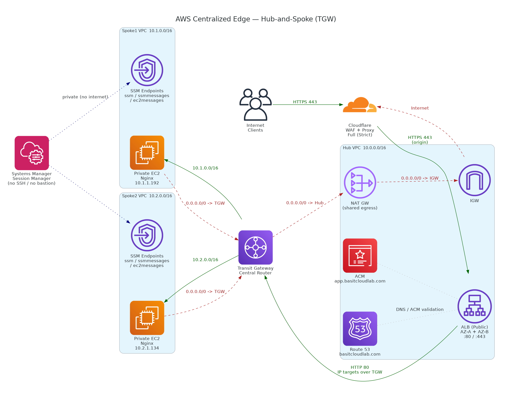

# AWS Centralized Edge — Hub-and-Spoke Architecture

A production-style AWS network built completely from scratch. A centralized **Hub VPC** connects to multiple **Spoke VPCs** through **AWS Transit Gateway**. Application servers stay fully private while traffic enters through an internet-facing **Application Load Balancer** protected by **Cloudflare** and **ACM** HTTPS certificates.

No SSH keys. No bastion hosts. All administration performed through **AWS Systems Manager Session Manager (SSM)**.

---


## Architecture

```
                    Internet
                        │
                  HTTPS (443)
                        │
                 Cloudflare Proxy
                        │
                app.basitcloudlab.com
                        │
                 Route 53 Hosted Zone
                        │
                 ACM SSL Certificate
                        │
              Application Load Balancer
                Hub VPC (10.0.0.0/16)
                        │
                ───────────────────
                        │
                  Transit Gateway
                  (Central Router)
                   /            \
                  /              \
                 /                \
        Spoke1 VPC                Spoke2 VPC
        10.1.0.0/16               10.2.0.0/16
            │                          │
        Private EC2                Private EC2
        Nginx Server               Nginx Server
```

---

## Services Used

Amazon VPC · Transit Gateway · EC2 · Systems Manager (SSM) · Interface VPC Endpoints · IAM Roles · NAT Gateway · Application Load Balancer · Target Groups · ACM · Route 53 · Cloudflare · Security Groups · Route Tables · Nginx

---

## Network Layout

### Hub VPC — `10.0.0.0/16`

- Public ALB subnet A
- Public ALB subnet B
- NAT Gateway subnet
- TGW attachment subnet

### Spoke1 VPC — `10.1.0.0/16`

- Private application subnet
- TGW subnet
- SSM interface endpoints
- Private EC2

### Spoke2 VPC — `10.2.0.0/16`

- Private application subnet
- TGW subnet
- SSM interface endpoints
- Private EC2

---

## Security Groups

### Hub-ALB-SG

| Direction | Protocol | Port | Source/Dest |
|-----------|----------|------|-------------|
| Inbound   | HTTP     | 80   | `0.0.0.0/0` |
| Inbound   | HTTPS    | 443  | `0.0.0.0/0` |
| Outbound  | All      | All  | All         |

### Spoke1-App-SG / Spoke2-App-SG

| Direction | Protocol | Port | Source        |
|-----------|----------|------|---------------|
| Inbound   | TCP      | 80   | `10.0.0.0/24` |
| Inbound   | TCP      | 80   | `10.0.1.0/24` |
| Outbound  | All      | All  | All           |

> Security-group references don't cross a Transit Gateway. The spoke App-SGs allow the **Hub ALB subnet CIDRs by range** — not an `sg-` reference.

---

## Transit Gateway Configuration

**Central Transit Gateway**, with three attachments: Hub VPC, Spoke1 VPC, Spoke2 VPC.

### TGW Route Table

| Destination   | Target            |
|---------------|-------------------|
| `10.0.0.0/16` | Hub attachment    |
| `10.1.0.0/16` | Spoke1 attachment |
| `10.2.0.0/16` | Spoke2 attachment |
| `0.0.0.0/0`   | Hub attachment    |

**Why `0.0.0.0/0` points to the Hub:** spoke VPCs have no Internet Gateway, so internet access is centralized through the Hub.

```
Private EC2 → Spoke Route Table → Transit Gateway → Hub Attachment
→ Hub TGW Route Table → NAT Gateway → Internet
```

This provides centralized egress, better security, reduced NAT cost, and simpler management.

---

## VPC Route Tables

### Hub-TGW-RT

| Destination   | Target      |
|---------------|-------------|
| `10.0.0.0/16` | local       |
| `10.1.0.0/16` | TGW         |
| `10.2.0.0/16` | TGW         |
| `0.0.0.0/0`   | NAT Gateway |

### Spoke1 Application Route Table

| Destination   | Target          |
|---------------|-----------------|
| `10.1.0.0/16` | local           |
| `0.0.0.0/0`   | Transit Gateway |

### Spoke2 Application Route Table

| Destination   | Target          |
|---------------|-----------------|
| `10.2.0.0/16` | local           |
| `0.0.0.0/0`   | Transit Gateway |

---

## Systems Manager Architecture

No SSH. No bastion host. Administration via **AWS Systems Manager Session Manager**.

### IAM Role — `EC2-SSM-Role`

Attached to both EC2 instances:

- `AmazonSSMManagedInstanceCore`

### Interface Endpoints

Each spoke VPC contains three interface endpoints (**6 total**):

| Service     | Endpoint                                |
|-------------|-----------------------------------------|
| SSM         | `com.amazonaws.us-east-1.ssm`           |
| SSM Messages| `com.amazonaws.us-east-1.ssmmessages`   |
| EC2 Messages| `com.amazonaws.us-east-1.ec2messages`   |

### IMDSv2 Configuration

**Problem:** SSM agent was offline — unable to acquire credentials.

**Solution:** modified instance metadata options:

- IMDSv2 **Required**
- HTTP PUT response hop limit = **2**

SSM came online immediately.

---

## NAT Gateway

Deployed in the Hub public subnet. Allows private EC2 instances to `yum update`, install nginx, and download packages **without** exposing servers to the internet.

---

## Installing Nginx

Connected via SSM:

```bash
sudo yum update -y
sudo yum install nginx -y
sudo systemctl enable nginx
sudo systemctl start nginx
```

**Spoke1 web page:**

```bash
echo "Spoke1 Application Server" | sudo tee /usr/share/nginx/html/index.html
```

**Spoke2 web page:**

```bash
echo "Spoke2 Application Server" | sudo tee /usr/share/nginx/html/index.html
```

---

## Application Load Balancer

Internet-facing, across AZ A and AZ B. Listener on **80**, later added **443**.

### Target Group

- **Type:** IP
- **Registered targets:** `10.1.1.192`, `10.2.1.134`
- **Health check:** HTTP `/` on port 80

**Troubleshooting — targets unhealthy / request timed out:** security-group rules were missing. Fix: allowed TCP 80 from `10.0.0.0/24` and `10.0.1.0/24`. Targets became healthy.

---

## ACM Certificate

- **Requested for:** `app.basitcloudlab.com`
- **Validation:** DNS
- **Status:** Issued

---

## Cloudflare Configuration

- **Record:** CNAME `app.basitcloudlab.com` → `central-edge-alb-xxxx.us-east-1.elb.amazonaws.com`
- **Proxy:** Enabled
- **SSL mode:** Full (Strict)
- **Always HTTPS:** Enabled

### HTTPS Traffic Flow

```
Browser → HTTPS → Cloudflare → HTTPS → ALB → HTTP → Transit Gateway → Private EC2
```

---

## Route 53

- **Hosted zone:** `basitcloudlab.com`
- **Record:** A Alias
- **Purpose:** ACM DNS validation and future AWS DNS integration. Actual client traffic enters through Cloudflare.

---

## Validation

| Check          | Command                  | Result                                       |
|----------------|--------------------------|----------------------------------------------|
| SSM            | `whoami`                 | `ssm-user`                                   |
| OS             | `cat /etc/os-release`    | Amazon Linux 2023                            |
| Internet       | `curl google.com`        | Successful                                   |
| Nginx          | `systemctl status nginx` | Active: running                              |
| ALB            | open `http://ALB-DNS`    | Alternates Spoke1 / Spoke2 Application Server|
| HTTPS          | open `https://app.basitcloudlab.com` | Successful                       |

---

## Troubleshooting Summary

| Issue                | Cause                              | Fix                                                      |
|----------------------|------------------------------------|---------------------------------------------------------|
| SSM offline          | Missing credentials                | IAM role + SSM interface endpoints + IMDSv2 hop limit 2  |
| `yum update` hanging | No internet access                 | Centralized NAT GW via `0.0.0.0/0` → TGW → Hub → NAT     |
| Target group unhealthy | SGs blocked port 80              | Added HTTP inbound from Hub ALB subnets                  |
| ACM cert pending     | DNS validation record missing      | Added ACM CNAME inside Cloudflare                        |
| Cannot delete ENI    | TGW attachment dependency          | Delete TGW attachment **before** VPC                     |

---

## Skills Demonstrated

VPC design · Transit Gateway · hub-and-spoke architecture · centralized internet egress · NAT Gateway · route tables · security groups · IAM · SSM Session Manager · interface endpoints · Application Load Balancer · target groups · health checks · ACM · Route 53 · Cloudflare · HTTPS · DNS · Nginx · high availability · multi-VPC networking · troubleshooting

---

## Resume Description

> Designed and implemented a production-style AWS hub-and-spoke architecture using Transit Gateway, centralized NAT Gateway egress, private EC2 instances, Systems Manager Session Manager, interface VPC endpoints, Application Load Balancer, ACM certificates, Route 53, and Cloudflare. Built secure end-to-end HTTPS connectivity without public servers or SSH access and validated highly available application delivery across multiple isolated VPCs.

---

## Future Improvements

Auto Scaling Groups · multi-region deployment · Route 53 failover routing · AWS WAF · CloudFront · Terraform automation · CI/CD pipeline · ECS/Fargate migration · Kubernetes integration

---

| | |
|---|---|
| **Project type** | Production-style AWS networking architecture |
| **Difficulty** | Advanced |
| **Built from scratch** | Yes |
| **Public EC2 instances** | None |
| **SSH used** | No |
| **Administration method** | AWS Systems Manager Session Manager |
| **Load balancing** | Application Load Balancer |
| **SSL** | ACM + Cloudflare Full Strict HTTPS |
| **High availability** | Multi-AZ ALB + multi-VPC architecture |
